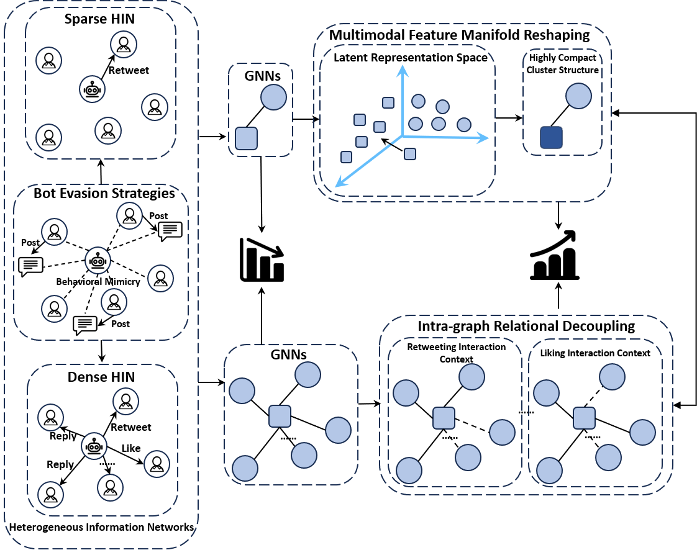
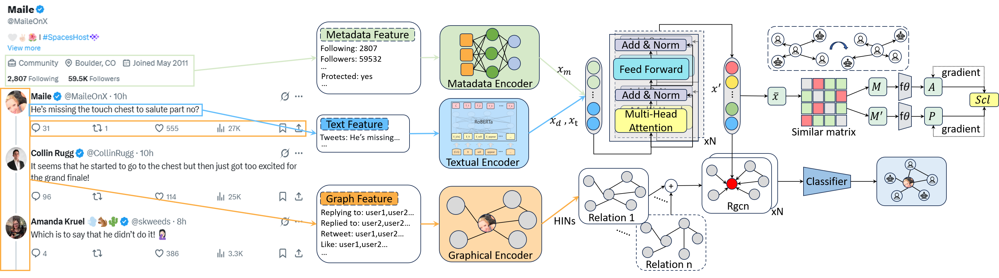

# MB-HGTBot: Modeling Multi-Type Social Behaviors in Heterogeneous Graphs for Robust Twitter Bot Detection

[](https://opensource.org/licenses/MIT)
[](https://pytorch.org/)
[](https://www.pyg.org/)

This repository contains the official PyTorch implementation of the paper: **"MB-HGTBot: Modeling Multi-Type Social Behaviors in Heterogeneous Graphs for Robust Twitter Bot Detection"**.

## 📄 Abstract

Existing studies predominantly utilize the topology of the Twittersphere to counteract the challenge of social bots circumventing detection via feature manipulation. However, the heterogeneity of users’ social behavioral patterns remains largely underexplored. 

To address this issue, we propose **MB-HGTBot**, a social behavior scenario-oriented framework for Twitter bot detection. Our approach effectively extracts and integrates multi-modal user semantic representations with numerical attributes while optimizing feature learning to improve the accuracy of bot detection. 

Specifically, we construct **heterogeneous information networks (HINs)** based on diverse social behaviors, enabling a more comprehensive characterization of structural variations underlying diverse social interactions, thereby significantly improving detection performance. Experimental results show that MB-HGTBot outperforms state-of-the-art methods, achieving an **accuracy of 88.11%** across six distinct social behavior patterns in the Twibot-22 dataset and three real-world topic-specific contexts. Furthermore, our findings highlight the pivotal role of social behavior diversity in Twitter bot detection and provide novel insights into addressing the challenges posed by manipulated features.

## 🖼️ Conceptual Framework

The core idea of MB-HGTBot is to leverage diverse social behavior patterns to construct a robust detection framework.


*Figure 1: The conceptual framework of MB-HGTBot, illustrating the modeling of multi-type social behaviors.*

## 🚀 Model Architecture

MB-HGTBot utilizes a Heterogeneous Graph Transformer mechanism to capture semantic and structural information across different relation types.


*Figure 2: The overall architecture of MB-HGTBot. It integrates multi-modal user semantic representations with heterogeneous graph learning.*

## 📂 Datasets

This project utilizes diverse social behavior datasets and topic-specific datasets. We have publicly released the processed datasets on Zenodo.

[](https://doi.org/10.5281/zenodo.17967052)

### 1. Download Data
You can download all required datasets (Follow, Reply, Like, Mention, Retweet, Quote, Abortion, LGBTQ, Trump_attacked) directly from our Zenodo repository:

* **Link**: [https://doi.org/10.5281/zenodo.17967052](https://doi.org/10.5281/zenodo.17967052)

### 2. Organize Data
After downloading and extracting the files, please organize them into the directory structure as data to ensure the code runs correctly:

```text
DatasetsForPaper/
├── DatasetsForPaper/
│   ├── Interaction/           # Social Behavior Sub-networks
│   │   ├── Follow/
│   │   ├── Reply/
│   │   ├── Like/
│   │   ├── Mention/
│   │   ├── Retweet/
│   │   └── Quote/
│   │
│   └── Topics/              # Topic-Specific Datasets
│       ├── Abortion/
│       ├── Lgbtq/
│       └── Trump_attacked/
│
├── data_preprocess/         # Preprocessing scripts
│   ├── Dataset_twibot_22.py
│   └── ...
```

## 🛠️ Environment Setup

This project is built on Python 3.10 and PyTorch 2.4.0.

### 1. Clone the repository
```bash
git clone https://github.com/Bemcliu/MB_HGTBot.git
cd MB-HGTBot
